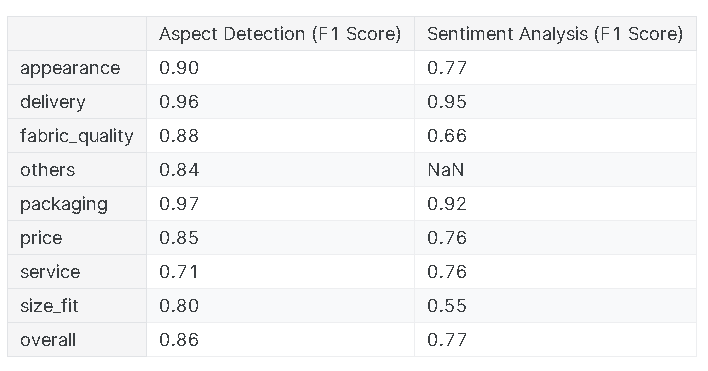

# Aspect-Based Learning in Fashion with Vietnamese dataset

This repository contains the implementation of aspect-based learning for Vietnamese comment data. The project explores various machine learning and deep learning approaches to aspect-based sentiment analysis, utilizing both traditional machine learning models and advanced neural network models. Here is a breakdown of the files and components included in this repository.

## Project Structure

- `crawl_data.py`: This notebook handles the data crawling process, extracting fashion shop comments from TIKI platform and saving them in a structured format for further analysis.
- `EDA.ipynb`: This notebook covers the Exploratory Data Analysis (EDA) of the dataset, providing insights into the distribution of aspects and sentiment classes in the dataset, normalize and clean the data, preprocess before training the models.
- `machine-learning-absa.ipynb`: This notebook contains the machine learning models, including implementations of **Random Forest** for aspect detection and **SVM** for sentiment analysis.
- `multitask-absa-bigru-conv1d.ipynb`: This notebook contains the deep learning models, featuring **BiGRU** and **Conv1D** architectures for multitasking on aspect detection and sentiment analysis.
- `phobert-embedding.ipynb`: This notebook explores the **PhoBERT** embeddings used in the deep learning models for enhancing the performance of Vietnamese text analysis.
- `absa-demo.ipynb`: A demonstration of how to use the trained models for real-time aspect-based sentiment analysis on Vietnamese text data.

## Installation

1. Clone the repository:
    ```bash
    git clone https://github.com/yourusername/aspect-based-learning-vietnamese.git
    ```
2. Install required dependencies:
    ```bash
    pip install -r requirements.txt
    ```

## Usage

1. **Data Crawling**: Run the `crawl_data.py` file to collect Vietnamese text data for ABSA.
2. **Exploratory Data Analysis**: Use the `EDA.ipynb` notebook to analyze and prepare the dataset before applying machine learning or deep learning models.
3. **Machine Learning Models**: Train and evaluate the Random Forest and SVM models by running the `machine-learning-absa.ipynb` notebook.
4. **Deep Learning Models**: Train and evaluate the BiGRU and Conv1D models by running the `multitask-absa-bigru-conv1d.ipynb` notebook.
5. **Embedding with PhoBERT**: Explore the effect of using PhoBERT embeddings in the deep learning models through the `phobert-embedding.ipynb` notebook.
6. **Demo**: Use the `absa-demo.ipynb` notebook to see the model in action with real-time predictions on Vietnamese text.

## Models

- **Machine Learning Models**: 
    - Random Forest
    - Support Vector Machine (SVM)
    
- **Deep Learning Models**:
    - BiGRU (Bidirectional Gated Recurrent Unit)
    - Conv1D (1D Convolutional Neural Network)

- **Embeddings**: 
    - TF-IDF (Term Frequency-Inverse Document Frequency)
    - PhoBERT (a pre-trained language model for Vietnamese)

## Results

### Machine Learning Models
- **Random Forest and SVM** provide a strong baseline for aspect detection, achieving high accuracy in identifying aspects of Vietnamese fashion comments.
- See evaluation metrics below:

  

### Deep Learning Models
- **BiGRU and Conv1D** with PhoBERT embeddings excel in sentiment analysis, effectively capturing contextual nuances in Vietnamese text.
- See evaluation metrics below:

  

## Demo

You can test the models using the `absa-demo.ipynb` notebook to classify aspects and sentiments in real-time from Vietnamese text inputs.

## Requirements

- Python 3.x
- Required libraries listed in `requirements.txt`

## License

This project is licensed under the MIT License - see the `LICENSE` file for details.